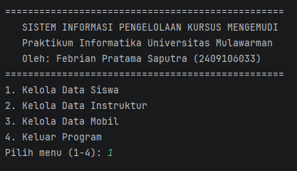
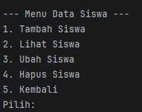
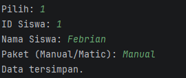
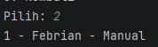
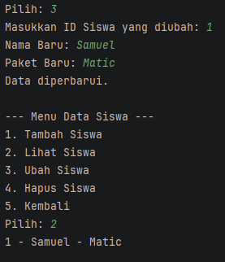
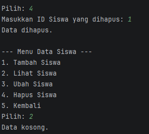

# Laporan Posttest 1 - Praktikum Pemrograman Berorientasi Objek

## Identitas
**Nama:** Febrian Pratama Saputra  
**NIM:** 2409106033  
**Program Studi:** Informatika, Universitas Mulawarman

---

## Deskripsi Program
Program ini adalah **Sistem Informasi Pengelolaan Kursus Mengemudi** berbasis *Command Line Interface* (CLI) yang ditulis menggunakan bahasa pemrograman Java (SDK 25). Sistem ini bertujuan untuk mengelola data operasional tempat kursus mengemudi dengan menerapkan konsep *Object-Oriented Programming* (OOP) dasar dan pemanfaatan *Collection* berupa `ArrayList`.

Sistem mengelola tiga entitas utama yang saling berkaitan dalam operasional kursus, yaitu:
1. **Siswa Mengemudi:** Menyimpan data peserta kursus beserta paket yang diambil.
2. **Instruktur:** Menyimpan data pengajar beserta jenis lisensi mengemudi yang dimiliki.
3. **Mobil:** Menyimpan data kendaraan yang digunakan untuk praktik.

---

## Fitur Program
Program dilengkapi dengan menu navigasi berulang (menggunakan perulangan `while`) dan memiliki fitur CRUD (*Create, Read, Update, Delete*) lengkap untuk setiap entitas:

* **Menu Siswa:**
    * Tambah data siswa (ID, Nama, Paket).
    * Tampilkan seluruh data siswa.
    * Ubah data siswa berdasarkan ID.
    * Hapus data siswa berdasarkan ID.
* **Menu Instruktur:**
    * Tambah data instruktur (ID, Nama, Lisensi).
    * Tampilkan seluruh data instruktur.
    * Ubah data instruktur berdasarkan ID.
    * Hapus data instruktur berdasarkan ID.
* **Menu Mobil:**
    * Tambah data mobil (Plat Nomor, Merk, Transmisi).
    * Tampilkan seluruh data mobil.
    * Ubah data mobil berdasarkan Plat Nomor.
    * Hapus data mobil berdasarkan Plat Nomor.

---

## Dokumentasi Output (Screenshot)
Untuk dokumentasi, hanya salah satu class (SiswaMengemudi) yang akan didokumentasi. Class lainnya akan memiliki tampilan dan fungsi yang sama.

### 1. Tampilan Menu Utama

### 2. Output Menu Siswa

### 3. Output Create Siswa (Tambah Data)

### 4. Output Lihat Siswa (Lihat Data)

### 5. Output Update Siswa (Ubah Data)

### 6. Output Update Siswa (Ubah Data)
